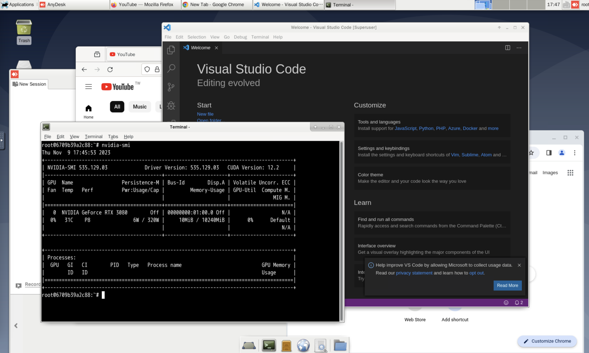

# Dev Dock (GUI)

Docker image that provides a remote desktop (Xfce + TigerVNC + noVNC + SSH) for development.

> Supports **x86_64** and **arm64** (aarch64). Build the image on the same architecture as the host so Firefox and VS Code run natively.



> See also: [development-container-manager](https://github.com/NatLee/dev-dock-manager) for GUI management.

## Included components

* **Xfce** desktop (lightweight)
* **TigerVNC** (port 5901) + **noVNC** (port 6901, browser access)
* **OpenSSH** (port 22)
* **VS Code** (launched with `--no-sandbox` for container compatibility)
* **Firefox**
* **AnyDesk**
* **Miniconda**
* **fcitx5** Chinese input (e.g. Pinyin); use `fcitx5-configtool` to add or switch input methods
* Git, vim, and common dev tools

## Build and run

Build on the **same architecture** as the host (e.g. on Apple Silicon, build there) to avoid "Dynamic loader not found" for Firefox/VS Code.

```bash
docker compose build && docker compose up
```

Or run in background:

```bash
docker compose up -d
```

## Pull from Docker Hub

Pre-built image: [natlee/gui-vnc](https://hub.docker.com/r/natlee/gui-vnc). Use the tag that matches your machine: **x86** (`-x86`) or **Apple Silicon / ARM** (`-arm64`).

Pull and run (replace `<TAG>` with e.g. `20250208-x86` or `20250208-arm64`):

```bash
docker pull natlee/gui-vnc:<TAG>

docker run -d \
  -p 12345:5901 -p 13579:6901 -p 24680:22 \
  -v /etc/localtime:/etc/localtime:ro \
  -e VNC_PW=mypassword \
  -e DEFAULT_USER=dev -e DEFAULT_USER_PASSWORD=dev \
  -e ROOT_PASSWORD=root \
  --name gui natlee/gui-vnc:<TAG>
```

Then open noVNC in browser: `http://localhost:13579/?password=mypassword`. See [Parameters](#parameters-environment--run-options) for more options (`LANG`, `VNC_RESOLUTION`, etc.).

## NVIDIA GPU

Install [NVIDIA Container Toolkit](https://docs.nvidia.com/datacenter/cloud-native/container-toolkit/latest/install-guide.html) on the host, then use the GPU compose file:

```bash
docker compose -f docker-compose.nvidia.yml build && docker compose -f docker-compose.nvidia.yml up
```

## Connection

| Service | Port (default) | How to connect |
|--------|----------------|-----------------|
| VNC    | 5901           | VNC client → `<HOST_IP>:<PORT>` |
| noVNC  | 6901           | Browser → `http://<HOST_IP>:6901/?password=<VNC_PW>` |
| SSH    | 22             | `ssh <user>@<HOST_IP> -p <PORT>` (user: `root` or `DEFAULT_USER`) |

With the default `docker-compose.yml`, host ports are mapped to **12345** (VNC), **13579** (noVNC), **24680** (SSH).

## Parameters (environment / run options)

| Variable | Default | Description |
|----------|---------|-------------|
| `VNC_PW` | vncpassword | VNC (and noVNC) password |
| `VNC_RESOLUTION` | 1600x900 | Desktop resolution |
| `VNC_VIEW_ONLY` | false | If true, noVNC is view-only |
| `DEFAULT_USER` | user | Non-root user for desktop (e.g. AnyDesk) |
| `DEFAULT_USER_PASSWORD` | user | Password for `DEFAULT_USER` |
| `ROOT_PASSWORD` | root | Root password |
| `LANG` | en_US.UTF-8 | Locale (e.g. `zh_TW.UTF-8` for Chinese) |

### Example: docker run

```bash
docker run -d \
  -p 12345:5901 -p 13579:6901 -p 24680:22 \
  -v /etc/localtime:/etc/localtime:ro \
  -v /path/on/host:/root/Desktop \
  -e VNC_PW=mypassword \
  -e VNC_RESOLUTION=1920x1080 \
  -e DEFAULT_USER=dev -e DEFAULT_USER_PASSWORD=dev \
  -e ROOT_PASSWORD=root \
  -e LANG=zh_TW.UTF-8 \
  --name gui gui-vnc
```

Build the image first (from this directory): `docker compose build` → image name is `gui-vnc`.

### Useful run options

* Map ports: `-p 12345:5901 -p 13579:6901 -p 24680:22`
* Timezone: `-v /etc/localtime:/etc/localtime:ro`
* Mount folder: `-v <HOST_PATH>:<CONTAINER_PATH>`

## License

[MIT](./LICENSE)
